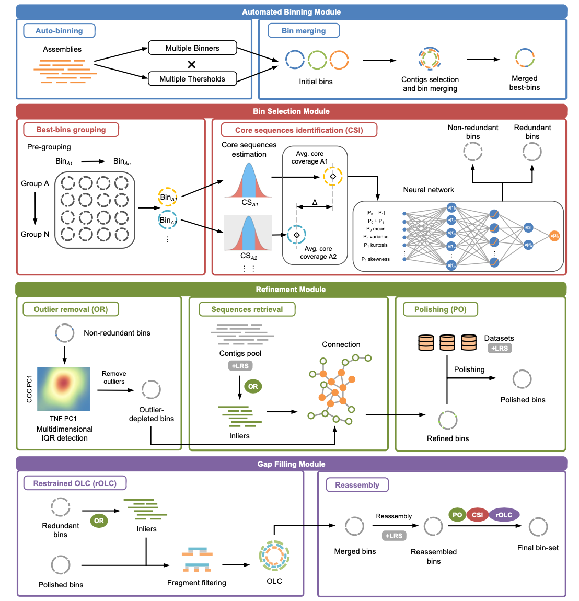

# BASALT-Air v1.0.0: Binning Across a Series of Assemblies Toolkit Air Version

**A lightweight, modular pipeline for high-quality metagenome-assembled genomes (MAGs) from short reads, long reads, and hybrid assemblies.**

[](https://doi.org/10.1038/s41467-024-46539-7)
[](LICENSE)

## Overview

BASALT is a versatile metagenomic binning pipeline that integrates autobinning, multi-assembly dereplication, deep-learning-based outlier removal, contig retrieval, OLC elongation, and reassembly in a unified workflow. It produces high-quality MAGs from diverse sequencing inputs.

**Key features:**

- **Absolute path support** — No need to `cd` into data directories; specify files from anywhere
- Multi-assembly binning and dereplication
- Deep learning-based bin refinement
- Support for short reads, long reads (ONT/PacBio), and HiFi
- Modular architecture (autobinning, refinement, reassembly, datafeeding)
- Reproducible runs with automatic logging and manifests

**Publication:** Qiu, Z. et al. _Nature Communications_ **15**, 2179 (2024). [doi:10.1038/s41467-024-46539-7](https://doi.org/10.1038/s41467-024-46539-7)

## Workflow

<p align="center">
  
</p>

BASALT consists of four modules:

| Module          | Steps  | Description                                                                                             |
| --------------- | ------ | ------------------------------------------------------------------------------------------------------- |
| **autobinning** | S1-S4  | Read mapping, binning (MetaBAT2/MaxBin2/CONCOCT/SemiBin), within-group and multi-assembly dereplication |
| **refinement**  | S5-S7  | DL-based outlier removal, contig retrieval, optional polishing                                          |
| **reassembly**  | S8-S10 | OLC elongation, short-read/hybrid reassembly, post-reassembly dereplication                             |
| **datafeeding** | —      | Integrate external binsets, re-run S4+S5                                                                |

Default `--module all` runs autobinning → refinement → reassembly sequentially.

## Installation

BASALT requires Python 3.12 and uses [pixi](https://pixi.sh) for dependency management.

### 1. Install pixi

```bash
curl -fsSL https://pixi.sh/install.sh | sh
```

### 2. Clone and configure

```bash
git clone https://github.com/EMBL-PKU/BASALT-Air.git
cd BASALT-Air
```

**Edit `pixi.toml`** (lines 85-87) to set your paths:

```toml
[activation.env]
BASALT_WEIGHT = "/your/path/to/basalt_weights"
CHECKM2DB     = "/your/path/to/checkm2db/CheckM2_database/uniref100.KO.1.dmnd"
```

**Optional:** Adjust CUDA version (line 13) if needed:

```toml
[system-requirements]
cuda = "12"  # Change to "11" or "13" based on your system
```

### 3. Install dependencies

```bash
pixi install
```

### 4. Download databases

**BASALT model weights** are available from:

- **Hugging Face:** [https://huggingface.co/PKU-EMBL/BASALT_WEIGHT](https://huggingface.co/PKU-EMBL/BASALT_WEIGHT)
- **Google Drive:** [https://drive.google.com/drive/folders/1d0e_2FpYRBAZLwKXl8fA-yDK4b5PBA_E](https://drive.google.com/drive/folders/1d0e_2FpYRBAZLwKXl8fA-yDK4b5PBA_E)
- **Baidu Netdisk (百度网盘):** [https://pan.baidu.com/s/1ouKqabxHYr1GmvpquQCzqw?pwd=embl](https://pan.baidu.com/s/1ouKqabxHYr1GmvpquQCzqw?pwd=embl) (提取码: embl)

**CheckM2 database and demo data** are available from Google Drive and Baidu Netdisk (links above).

Download and extract:

- `basalt_weights/` → Set as `BASALT_WEIGHT` in `pixi.toml`
- `checkm2db/` → Set `CHECKM2DB` to `checkm2db/CheckM2_database/uniref100.KO.1.dmnd` in `pixi.toml`
- `checkmdb/` (optional) → For legacy CheckM support

**Quick download with Hugging Face CLI:**

```bash
# Install huggingface-cli
pip install huggingface_hub

# Download BASALT weights
huggingface-cli download PKU-EMBL/BASALT_WEIGHT --local-dir /your/path/to/basalt_weights
```

Alternatively, use pixi tasks to download automatically:

```bash
pixi run download-weights  # BASALT DL models (~100 MB)
pixi run checkm2-db        # CheckM2 database (~3 GB)
```

### 5. Verify installation

```bash
pixi shell
BASALT --version
BASALT --check-deps
```

## Quick Start

### Basic usage

```bash
pixi shell  # Activate environment

# Single assembly + paired-end reads
BASALT -a assembly.fa -s r1.fq,r2.fq -t 32 -m 128

# Multiple assemblies + datasets
BASALT -a as1.fa,as2.fa,as3.fa \
       -s d1_r1.fq,d1_r2.fq/d2_r1.fq,d2_r2.fq/d3_r1.fq,d3_r2.fq \
       -t 60 -m 250

# Hybrid assembly (short + long + HiFi)
BASALT -a assembly.fa \
       -s sr_r1.fq,sr_r2.fq \
       -l ont.fq \
       -hf hifi.fq \
       -t 60 -m 250
```

### Using absolute paths (recommended)

**No need to `cd` into data directories!** BASALT-Air accepts absolute paths for all inputs:

```bash
# Run from anywhere with absolute paths
BASALT \
    -a /path/to/data/assembly.fa \
    -s /path/to/data/sample1.R1.fq,/path/to/data/sample1.R2.fq \
    -l /path/to/data/sample1.nanopore.fq \
    -t 64 -m 128 \
    -o my_project \
    --workdir /scratch/work \
    --outdir /results/output

# Multiple datasets with absolute paths (use ';' as separator)
BASALT \
    -a /data/as1.fa,/data/as2.fa \
    -s /data/s1_R1.fq,/data/s1_R2.fq;/data/s2_R1.fq,/data/s2_R2.fq \
    -t 64 -m 128
```

**Key parameters:**

- `--workdir` — Directory for intermediate files (default: current directory)
- `--outdir` — Directory for final output (default: same as workdir)

### Key options

| Flag        | Description                                      | Default        |
| ----------- | ------------------------------------------------ | -------------- |
| `-a`        | Assembly FASTA (comma-separated)                 | —              |
| `-s`        | Paired-end short reads                           | —              |
| `-l`        | Long reads (ONT/PacBio CLR)                      | —              |
| `-hf`       | PacBio HiFi reads                                | —              |
| `-t`        | Threads                                          | 4              |
| `-m`        | RAM (GB)                                         | 32             |
| `-q`        | Quality check: `checkm2` or `checkm`             | `checkm2`      |
| `--module`  | `all`, `autobinning`, `refinement`, `reassembly` | `all`          |
| `--min-cpn` | Minimum completeness (%)                         | 35             |
| `--max-ctn` | Maximum contamination (%)                        | 20             |
| `-o`        | Output folder name                               | `Final_binset` |

Run `BASALT --help` for full options.

### Demo dataset

Test BASALT-Air with our demo dataset:

**Download from:**

- **Google Drive:** [https://drive.google.com/drive/folders/1d0e_2FpYRBAZLwKXl8fA-yDK4b5PBA_E](https://drive.google.com/drive/folders/1d0e_2FpYRBAZLwKXl8fA-yDK4b5PBA_E)

```bash
# Extract demo data
tar -xzf BASALT_demo.tar.gz

# Run from anywhere using absolute paths (no need to cd!)
pixi shell
BASALT \
    -a /path/to/BASALT_demo/Data/assembly.fa \
    -s /path/to/BASALT_demo/Data/sample1.R1.fq,/path/to/BASALT_demo/Data/sample1.R2.fq \
    -l /path/to/BASALT_demo/Data/sample1.nanopore.fq \
    -t 64 -m 128 \
    -o demo_run \
    --workdir /scratch/demo_work \
    --outdir /results/demo_output
```

This demo includes a hybrid assembly with short reads and Nanopore long reads.

## Output

Results are written to `<output_folder>/` (default: `Final_binset/`):

- `*.fa` — Final dereplicated MAGs
- `OLC_quality_report.tsv` — Completeness, contamination, N50, etc.
- `BASALT_run_manifest.json` — Full reproducibility metadata
- `Basalt_log.txt` — Timestamped pipeline log

## Citation

If you use BASALT in your research, please cite:

```bibtex
@article{qiu2024basalt,
  title   = {BASALT refines binning from metagenomic data and increases
             resolution of genome-resolved metagenomic analysis},
  author  = {Qiu, Zhiguang and Yuan, Li and Lian, Chun-Ang and Lin, Bin
             and Chen, Jie and Mu, Rong and Qiao, Xuejiao and Zhang, Liyu
             and Xu, Zheng and Fan, Lu and others},
  journal = {Nature Communications},
  volume  = {15},
  number  = {1},
  pages   = {2179},
  year    = {2024},
  doi     = {10.1038/s41467-024-46539-7}
}
```

---

## License

MIT License. See [LICENSE](LICENSE) for details.

---

## Contact

For issues and questions, please open an issue on [GitHub](https://github.com/EMBL-PKU/BASALT-Air/issues) or contact <yuke.sz@pku.edu.cn> and <zrjiang25@stu.pku.edu.cn>.
